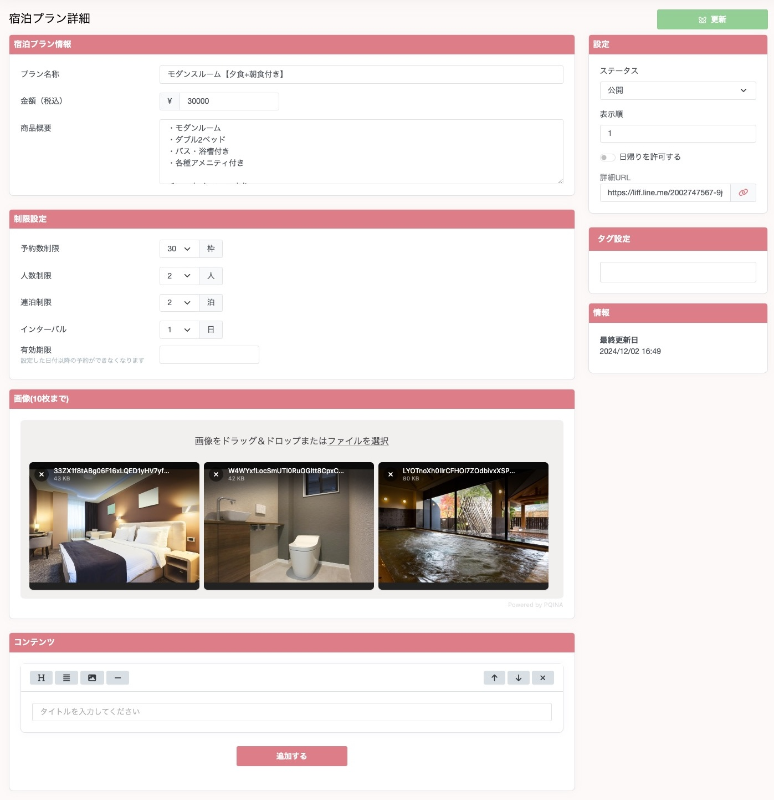

## 宿泊プランを作成する

### 宿泊プラン情報
1. プラン名称
   1. プランの名称を設定することができます。
2. 金額
   1. 予約する際の金額を設定することができます。
3. 商品概要
   1. プランの概要を設定することができます。
### 制限設定
1. 予約数制限
   1. 予約を同日にいくつまで受けられるかを設定することができます。
2. 人数制限
   1. ユーザーが予約をする際に人数を選択する際に、何人までの予約として受け付けられるのか設定することができます。
3. 連泊制限
   1. ユーザーが予約をする際に何泊まで選択できるかを設定することができます。
4. 有効期限
   1. 設定した日付以降の予約ができなくなります。期間限定のプランとして作成する際に有効です。
### その他
1. 画像
   1. 写真などの画像を設定することができます。1つのプランにつき設定できる画像は10個までとなっております。
2. コンテンツ
   1. リッチコンテンツを設定することができます。
3. 日帰りを許可する
   1. 日帰りを許可するをONにしていただくと、ユーザーが予約をする際に、日帰り予約ができるようになります。