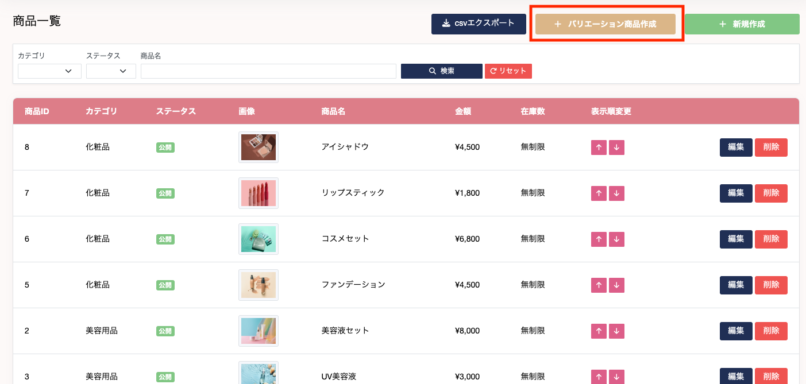
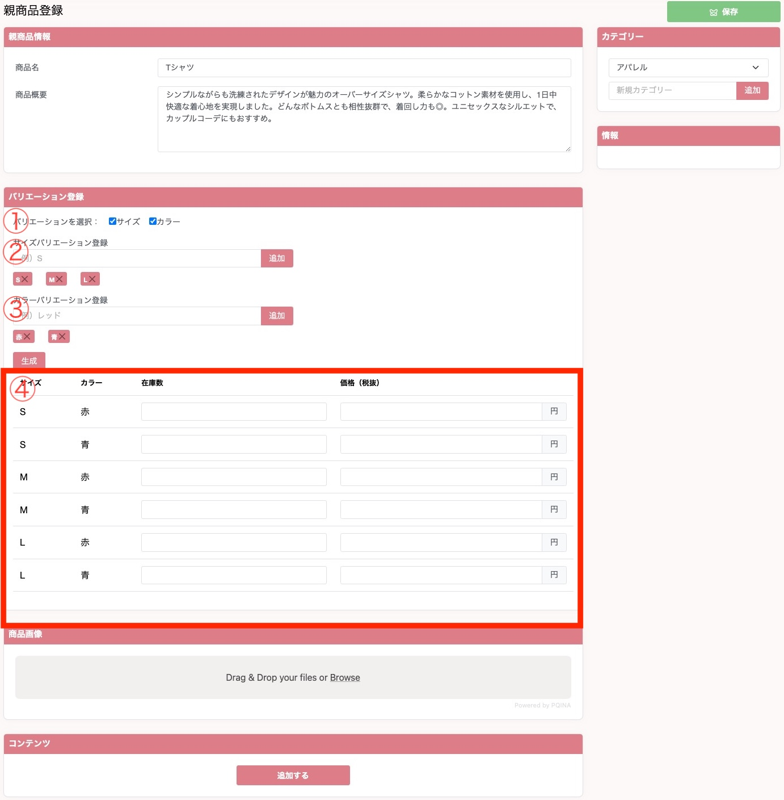

## バリエーション商品を登録する

EC管理 > 商品一覧ページ上部、**バリエーション商品作成**ボタンよりバリエーション商品の登録をすることができます。これは、色違いの商品を登録する際に便利な機能となっています。例えば服などの商品を売っている場合、色違い、サイズ違いの商品を一度に作成することができ、ユーザーが購入する際もまとめて表示されます。  

1. 設定するバリエーションを選択してください。選択されたバリエーション情報によって、②、③の入力項目が変化します。
2. サイズバリエーションを設定することができます。設定したいサイズを入力したのち、追加ボタンを押してください。もし謝って入力してしまった場合は、入力フォーム下に追加された項目を x で消すことができます。
3. カラーバリエーションを設定することができます。設定したいカラーを入力したのち、追加ボタンを押してください。もし謝って入力してしまった場合は、入力フォーム下に追加された項目を x で消すことができます。
4. ②、③を設定したのち、生成ボタンを押下すると、新たに入力項目が追加されます。それぞれの在庫数と価格を入力してください。  

追加されたバリエーション商品はユーザー視点下記のような形式となります。

ユーザーがサイズやカラーをセレクトボックスから変更することで自動的に、そのサイズやカラーの商品に切り替わります。