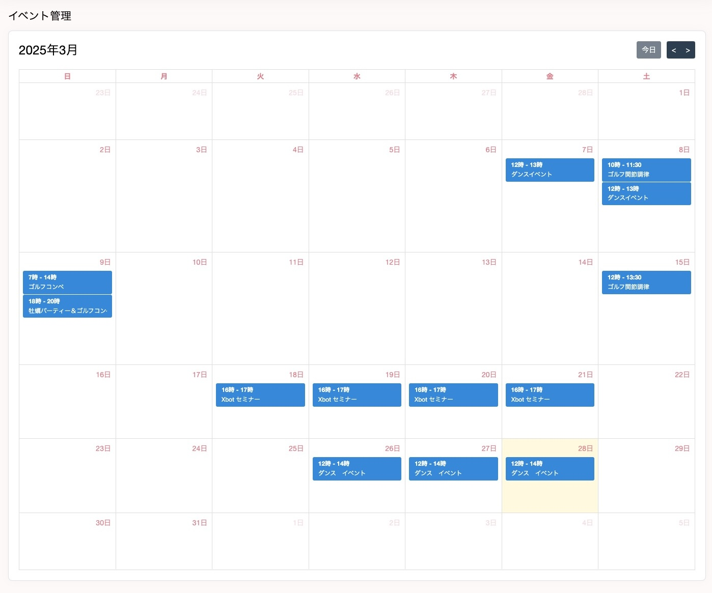
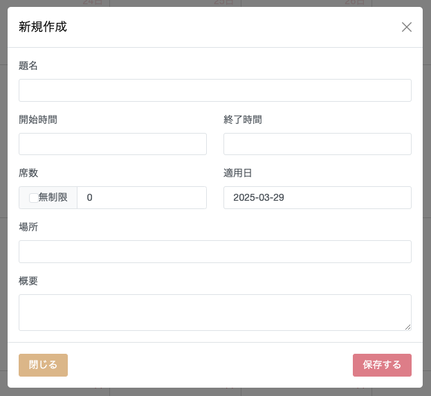

## イベントを作成する
  

カレンダー形式でイベントを作成することができます。カレンダーの日付部分をクリックすることで新規作成モーダルが画面上に開かれます。  

- 題名
  - イベントのタイトルを入力することができます。
- 開始時間
  - イベントの開始時間を入力することができます。
- 終了時間
  - イベントの終了時間を入力することができます。
- 席数
  - イベントの席数を設定することができます。このイベントの席数は実際の予約数に紐づいており、その予約数上限に達すると予約ができなくなります。また、無制限にチェックを入れることで上限なしでイベントを作成することができます。
- 適用日
  - 適用日を複数選択することで、一度に同じイベントを入力することができます。
- 場所
  - 場所を設定することができます。
- 概要
  - 概要文を設定することができます。