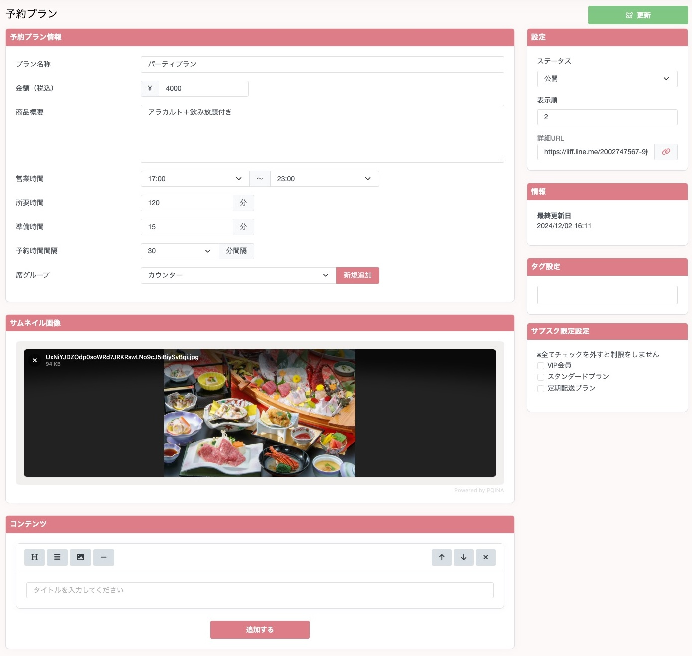

## 予約プランを作成する

### 予約プラン情報
- プラン名称
  - プランの名称を設定することができます。
- 金額
  - プランの金額を設定することができます。
- 商品概要
  - プランの概要を設定することができます。
- 営業時間
  - ユーザーが予約できる時間の範囲を選択することができます。
- 所要時間
  - ユーザーが該当プランに予約する際の所要時間を設定することができます。こちらに設定された時間に応じて、他ユーザーが予約できなくなります。
- 準備時間
  - ユーザーが予約した際に片付けなどを想定して、設定された時間が経過しないと他のユーザーが予約できなくなります。
- 予約時間間隔
  - 何分単位で予約できるかを設定することができます。
- 席グループ
  - この席グループを選択することで、別のプランであっても、席数の共有をすることができます。  
例として大規模カラオケルームが3部屋あった際に大規模カラオケルームという席グループを作成。席グループの設定には3席と設定しておきます。その後、パーティープラン（1時間）、パーティープラン（2時間）とそれぞれ予約プランを作成する際に席グループを大規模カラオケルームに設定しておくと、パーティープラン（1時間）で同じ時間に予約が3つ入った際に、パーティープラン（2時間）の方でもその時間には予約できなくなります。
- サムネイル画像
  - サムネイル画像の設定を行うことができます。
- コンテンツ
  - リッチコンテンツを設定することができます。
- サブスク限定設定
  - サブスク限定プランにすることが可能です。許可したいサブスクプランを選択することで、該当のサブスクプランに加入しているユーザーしか予約できなくなります。