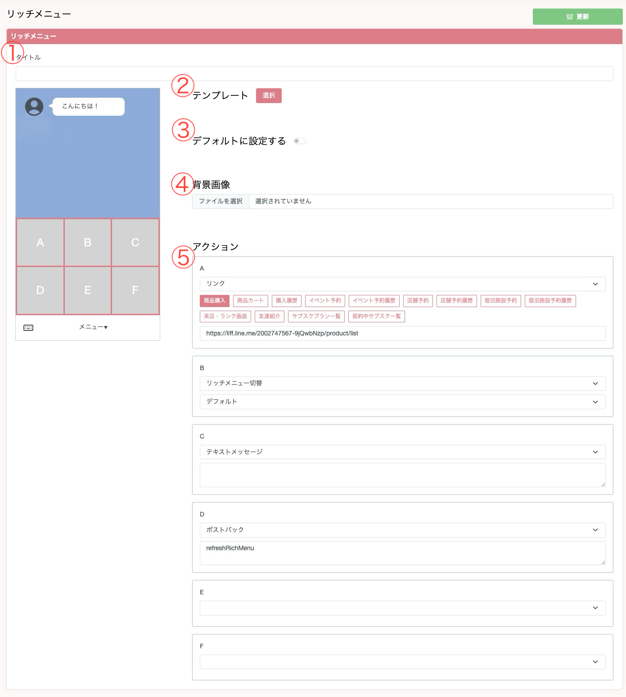
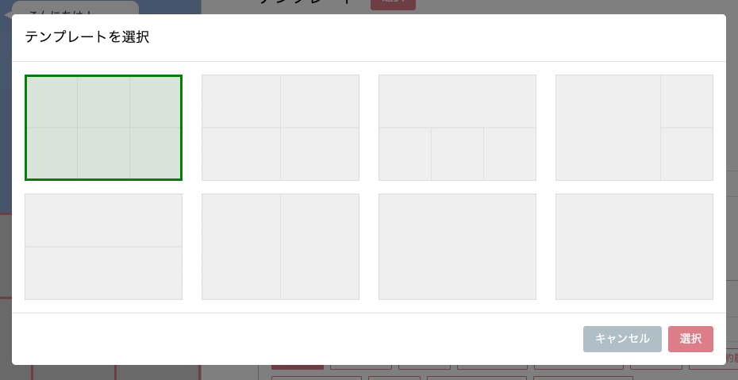

## リッチメニューの設定をする
LINEアカウント管理 > リッチメニュー一覧よりリッチメニューの作成・編集を行うことができます。  

  

1. タイトルを設定することができます。
2. テンプレートを設定することができます。それぞれ次のタイプがあります。

なお一番右下のテンプレートを選択すると、タブ分け型のテンプレートにすることができます。
1. デフォルトに設定するをONにすると、ユーザーが友達追加した際にすぐに該当のリッチメニューが付与されるようになります。なお、LINEオフィシャルアカウントマネージャーより設定されているリッチメニューよりも、こちらの設定が優先されます。
2. 背景画像を設定することができます。
3. 各アクションを設定することができます。アクションは下記の通りです。
   1. リンク
      1. リンクを設定することで、そのエリアをタップした際に設定したページが開きます。商品購入、商品カートなどのボタンを押していただくことで、Xbot内の機能に遷移するためのリンクが自動的に設定されます。これらのボタンを押さずとも、リンクを直接入力することも可能なので、独自の公式サイトを設置することもできます。
   2. リッチメニュー切替
      1. こちらを設定することで、そのエリアをタップした際にリッチメニューを切り替えることができます。
   3. テキストメッセージ
      1. こちらを設定することで、ユーザーからメッセージを送信させることができます。
   4. ポストバック（実験的機能）
      1. こちらは現状対応している機能としてはリッチメニューをリフレッシュする機能だけとなっております。リッチメニューをリフレッシュさせる機能として使う場合にはrefreshRichMenuという文字列を設定してください。  

## リッチメニューの編集について
&emsp;リッチメニューの編集に関しては再度ユーザーに編集したリッチメニューを付与する都合上1日3回までとなっております。これはLINE社側の仕様に則っています。