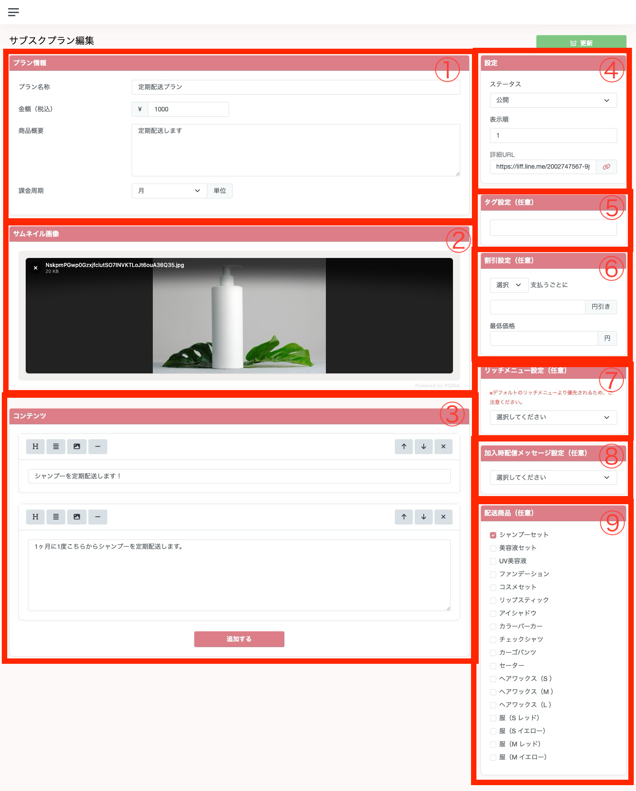

1. 各種情報を入力することができます。
2. サムネイル画像を設定することができます。
3. リッチな説明文を設定することができます。
4. ステータスの設定や、表示順を変更することができます。また、詳細URLをセグメント配信することで、ユーザーに対して訴求することができます。
5. タグを設定することができます。
6. 支払いを行うごとに、値段を下げることができます。また、最低価格の設定を行うことで、下限値を設定することができます。
7. リッチメニューを設定することで、該当のプランに加入したユーザーに対して特別なリッチメニューを付与することができます。有料会員プランを作成する際に、特別な見た目のリッチメニューに変更することができる機能です。
8. メッセージを設定することで、加入時にお礼のメッセージなどを送信することができます。
9. 配送商品を紐づけることで、定期的に注文が自動作成されます。注文を確認するにはEC管理 > 注文一覧からご確認ください。