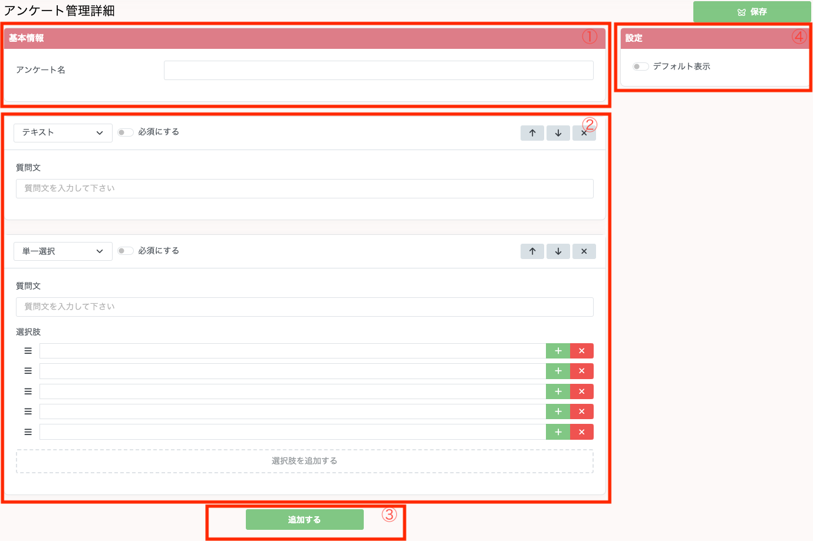

## アンケートの内容を設定する

1. アンケート名を設定することができます。
2. 実際のアンケート内容を設定することができます。質問タイプは以下の5種類があります。
   1. テキスト
   2. テキストエリア
   3. セレクトボックス
   4. 単一選択（ラジオボタン）
   5. 複数選択（チェックボックス）  
セレクトボックス、単一選択、複数選択を選択した際には画面下部の選択肢の入力項目が追加されます。こちらに追加したい選択肢を入力していただくことで、ユーザーにアンケートの選択肢を追加することが可能です。  
また選択肢右側のプラスマークを押下していただくことで、ユーザーがその選択肢を選んだ際にだけ表示される追加の質問を設定することが可能です。
3. 追加するボタンを押下していただくことで、質問項目を増やすことができます。
4. デフォルト表示をONにしていただくことで、ユーザーが友達追加した際に表示されるアンケートにこのカスタムアンケートを追加することができます。