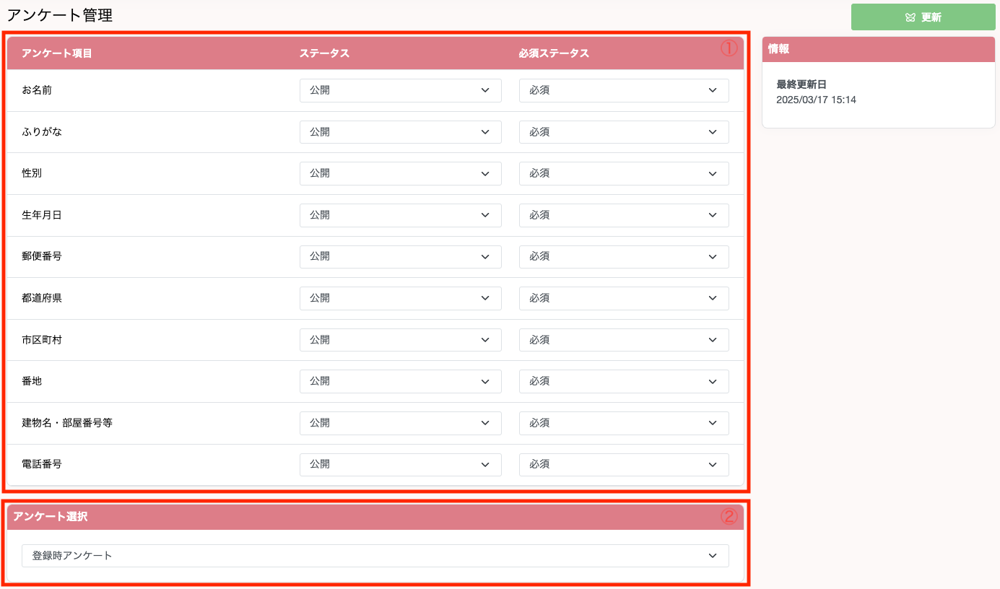

## 友達登録時の初回アンケートの内容を設定する
&emsp;初回アンケートはサイドバー アンケート管理 > お客様情報管理 より変更することができます。

1. デフォルトのアンケートを編集することが可能です。  
ステータスを非公開にすることで、アンケートの回答画面に表示されなくなります。  
また、必須ステータスを変更することで、任意 / 必須の切り替えが可能です。
2. カスタマイズされたアンケートを設定することが可能です。これは友達登録時に①の項目以外の情報を取得したい場合、アンケートを作成した後、本画面より選択していただくことでアンケートの回答画面に表示されます。  
カスタマイズされたアンケートの設定に関しては下記リンクをご参照ください。  
[アンケート内容を設定する](survey/create.md)