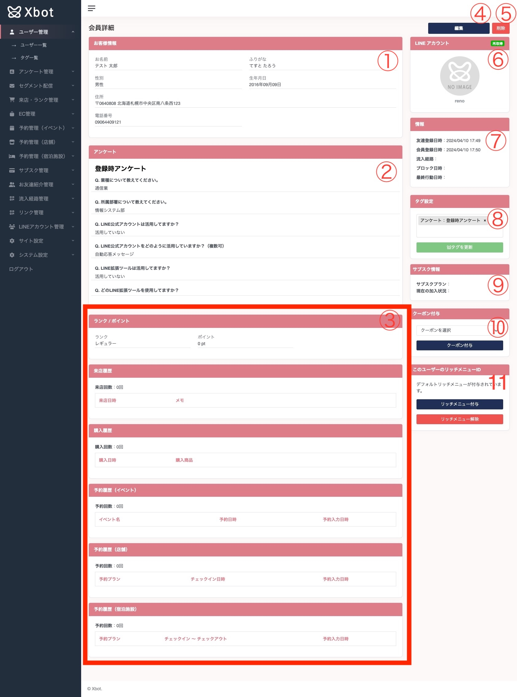

1. ユーザーの情報が表示されます。表示されるデータはアンケート管理のお客様情報管理の設定によって変化します。
2. そのユーザーが今までアンケートに答えてきた結果全てが表示されます。
3. それぞれのアクションの履歴が表示されます。表示される内容は契約内容によって変化します。
4. ユーザーの編集ページへ遷移することができます。
5. ユーザーを削除することができます。削除したユーザーは基本的に復旧できないのでご注意ください。
6. ユーザーの設定されているLINE情報が表示されます。右上の再取得ボタンを押下することで、最新のLINE情報を取得することが可能です。
7. ユーザーのそれぞれのアクション時間を確認することが可能です。
8. ユーザーへタグを設定、もしくは解除することが可能です。こちらのタグはユーザーのアクションによって自動的に付与されることがあります。  
例えば、アンケートに回答すると自動的に **アンケート：登録時アンケート** というタグが付与されます。
9. サブスクの加入状況を確認することができます。契約状況によってはこちらは表示されません。
10. クーポンを付与することができます。もしクーポンが未作成の場合は、EC管理->クーポン一覧より新規作成してください。
11. リッチメニューの付与状況を確認することができます。例えば、サブスク機能にリッチメニューを紐づけている場合、こちらの画面でリッチメニューの解除や、再付与を行うことができます。なお、このリッチメニューはデフォルト設定されているリッチメニューよりも優先的に付与されます。