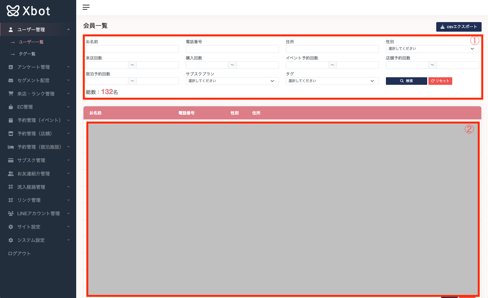

## 友達追加をしたユーザーを確認する

1. 検索することが可能です。基本的にはAND条件となっております。  
例：お名前（サンプル太郎）、性別（男性） -> 名前がサンプル太郎**かつ**性別が男性の方が条件に当てはまる。  
基本的に**ページ遷移しても検索条件はリセットされない**ので、検索条件をリセットする場合には検索ボタン横のリセットボタンを押下してください。
また、後述のアンケート管理で設定された項目のみ表示されますので、
2. LINEに友達追加したユーザーが表示されます。詳細ボタンを押すことでユーザーの詳細/編集を行うことができます。