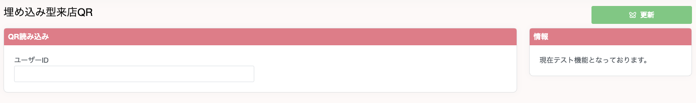

## QRリーダー設置する場合（β版）

&emsp;専用のQRリーダーを使うことで店舗で来店履歴を記録する際に、スムーズに記録することができます。来店・ランク管理 > 埋め込み型QR読み込みページを開き、入力フォームにフォーカスされてる状態で、専用のQRリーダーにユーザーのマイページのQRコードをかざすことで、自動的に来店処理が完了します。  
### 動作確認済みQRリーダー
- F3N-JP
  - https://amzn.asia/d/1vWvpRu